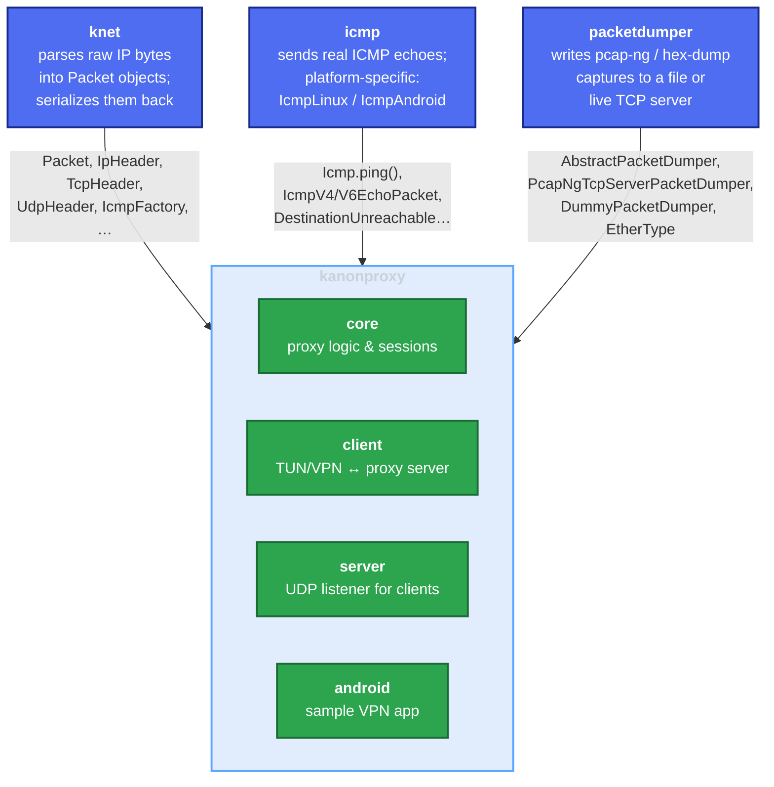
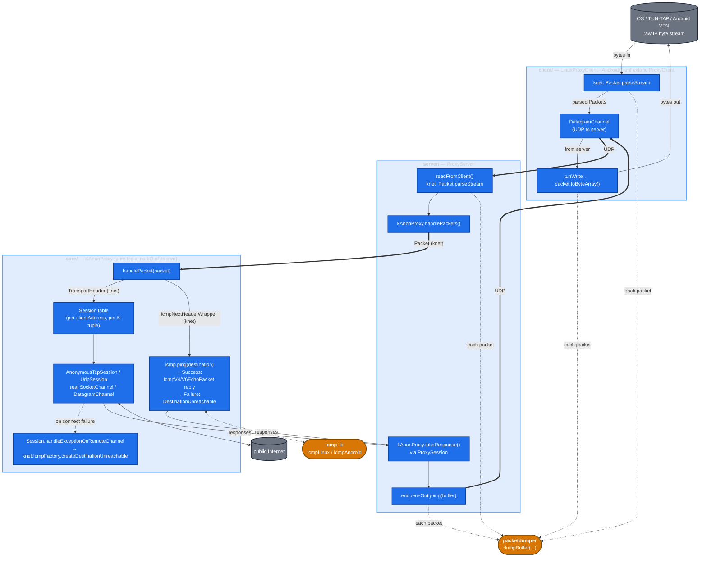

# Architecture: how knet, icmp, and packetdumper fit into kanonproxy

This is an onboarding-oriented map of how the three external libraries
[knet](https://github.com/compscidr/knet),
[icmp](https://github.com/compscidr/icmp), and
[packetdumper](https://github.com/compscidr/packetdumper) interact with the
four kanonproxy modules (`core`, `client`, `server`, `android`).

## 1. Repo relationships at a glance

knet, icmp, and packetdumper are independent libraries (separate repos,
separate Maven Central artifacts) that kanonproxy depends on:

- **knet** — "what is this packet?" Parses raw IP bytes into typed `Packet`
  objects and serializes them back.
- **icmp** — "actually emit a real ping." Provides the platform-specific raw-
  socket implementations (`IcmpLinux`, `IcmpAndroid`).
- **packetdumper** — "see what's flowing through." An optional observability
  hook injected into `ProxyServer` / `ProxyClient` / `KAnonVpnService` that
  dumps every packet to a pcap-ng stream (live-tailable from Wireshark via
  `wireshark -k -i TCP@127.0.0.1:19000`) or to a file. `DummyPacketDumper`
  is the no-op default so it costs nothing in production.

kanonproxy stitches these together with its own session management, TCP
state machine, and platform glue.

## 2. Data flow — one packet round-trip

## 3. Library responsibilities — who owns what

| Concern | Library | What it gives kanonproxy |
|---|---|---|
| Parse a raw IP byte stream into objects | **knet** | `Packet.parseStream(ByteBuffer)` |
| IP / TCP / UDP / ICMP header data classes (read + serialize) | **knet** | `Ipv4Header`, `Ipv6Header`, `TcpHeader`, `UdpHeader`, `IcmpNextHeaderWrapper`, `IcmpFactory` |
| Serialize a `Packet` back to bytes | **knet** | `packet.toByteArray()` |
| Actually emit ICMP echo to the real network | **icmp** | `Icmp.ping(InetAddress)` — `IcmpLinux` (raw socket) on JVM, `IcmpAndroid` on Android |
| ICMP echo / destination-unreachable packet types and codes | **icmp** | `IcmpV4EchoPacket`, `IcmpV6EchoPacket`, `IcmpV4/V6DestinationUnreachablePacket`, `IcmpV4/V6DestinationUnreachableCodes` |
| Capture a copy of every packet for debugging | **packetdumper** | `AbstractPacketDumper.dumpBuffer(ByteBuffer, EtherType)` |
| Live pcap-ng stream consumable by Wireshark | **packetdumper** | `PcapNgTcpServerPacketDumper` (default port 19000) |
| No-op dumper for production / tests | **packetdumper** | `DummyPacketDumper` |

Key point: **knet handles every other protocol end-to-end** (parse + build + serialize).
For TCP and UDP, kanonproxy itself opens the outbound connections using ordinary
`SocketChannel` / `DatagramChannel` instances inside `AnonymousTcpSession` / `UdpSession`.
**ICMP is the exception**: because emitting a real ICMP echo requires privileged raw-socket
access (and differs between Linux and Android), that emission is delegated to the icmp
library via `Icmp.ping(...)`, with `IcmpLinux` / `IcmpAndroid` providing the platform
implementation.

## 4. Where each library is wired in

- **`KAnonProxy(icmp: Icmp, ...)`** — single constructor injection point. Caller passes
  `IcmpLinux` (server `main`) or `IcmpAndroid` (`KAnonVpnService` on Android).
- **`ProxyServer`** parses inbound UDP from clients with `Packet.parseStream` (knet) and
  forwards into `KAnonProxy`. Also accepts an `AbstractPacketDumper` (packetdumper) and
  calls `dumpBuffer(...)` on every packet in both directions; `ProxyServer.main` boots a
  `PcapNgTcpServerPacketDumper` on port `DEFAULT_PORT + 1`.
- **`ProxyClient`** parses both directions with knet — TUN→proxy and proxy→TUN — and
  dumps each packet through its injected `AbstractPacketDumper`.
- **`KAnonVpnService`** (android) wires a `PcapNgTcpServerPacketDumper` into the
  in-process `ProxyServer` / `AndroidClient` so on-device captures can be tailed live
  from Wireshark.
- **`Session.handleExceptionOnRemoteChannel`** uses knet's `IcmpFactory` to fabricate a
  "host unreachable" reply when a TCP/UDP outbound connect fails — so even non-ICMP
  failures synthesize ICMP responses, and that synthesis lives in knet.
